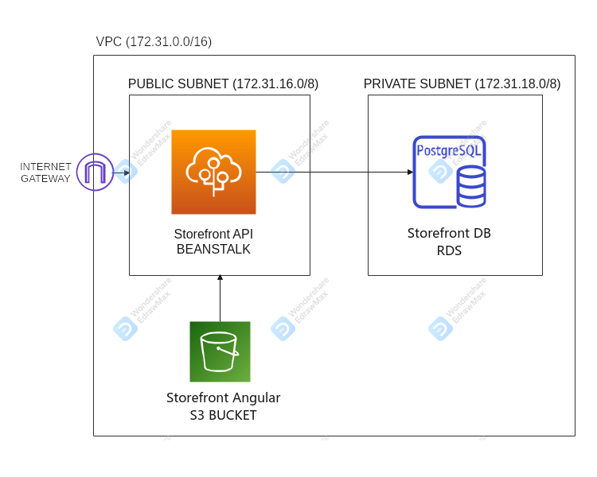
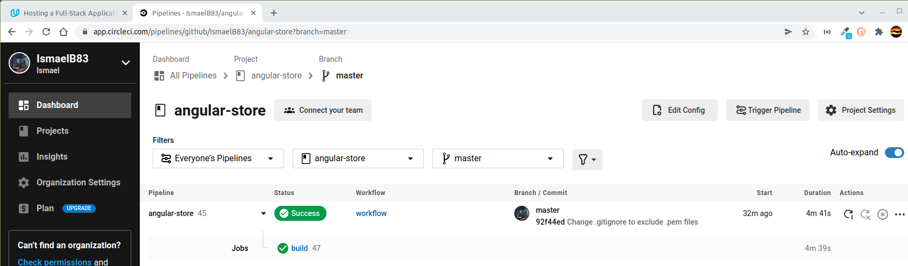

# ANGULAR-STORE

Single Page Application that allows users to view a list of available products to purchase, add them to a shopping cart, and ultimately complete the checkout process. 

The project  has two main parts:
* Frontend: angular app generated with [Angular CLI](https://github.com/angular/angular-cli) version 12.2.6
* Backend API: written in typescript/express and using postgres as the SQL DB.

This repo contains CircleCI integration to achieve CI/CD in AWS. Either way you can find as well the instructions to build & deploy manually each component in your own infrastructure.

You can find this app working in URL: https://udacity-nanodegree-js-iba.s3.us-west-2.amazonaws.com/index.html

## SHOPPING FLOW


## CONTENTS

- [ARCHITECTURE](#ARCHITECTURE)
- [CI/CD](#CI-CD)
- [INSTRUCTIONS TO MANUAL INSTALLATION](#INSTRUCTIONS-TO-MANUAL-INSTALLATION)

## ARCHITECTURE

This application uses the following AWS Services:
1) Database is deployed in an RDS Postgres DB
2) Backend API is deployed using a Beanstalk for Node applications
3) Frontend is server trough an S3 Bucket

The architecture diagram is as follows:


For more information regarding Architecture see [ARCHITECTURE DOCUMENT](docs/ARCHITECTURE.md)

## CI-CD

Within folder .circleci you can find config.yml with all the steps preconfigured to achieve the CI/CD integration. This file works in conjunction with each bin/deploy.sh files in storefront-backend-api and storefront-frontend. As well as general package.json file (that you can find in this same path):

The config.yml file forces CircleCI to use node version 14.18.1. This is due to the existing problem in version 17.1 (which is the default stable version used by CircleCI at the moment) with crypto SSL (more info searching "node 17 digital envelope routines"). 

For more information regarding CI/CD pipeline please refer to [CI/CD PILELINE](docs/CIRCLECI.md)



## INSTRUCTIONS TO MANUAL INSTALLATION

To download the repository

```
\downloads\git clone https://github.com/IsmaelB83/angular-store.git
```

And then enter in directory storefront-backend-api, and follow instructions to start BACKEND API: [BACKEND](storefront-backend-api/README.md)
```
\downloads\cd angular-store\storefront-backend-api\
```

With backend-api up and running, follow instructions to start the frontend: [STORE FRONTEND](storefront-frontend/README.md)
```
\downloads\cd angular-store\storefront-frontend\
```