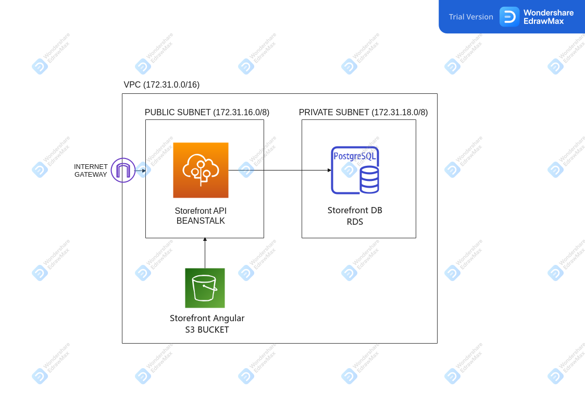

# ANGULAR-STORE

This store is an SPA Angular application that allows users to view a list of available products to purchase, add them to a shopping cart, and ultimately complete the checkout process. 

The project was has two main parts:
* Frontend: angular app generated with [Angular CLI](https://github.com/angular/angular-cli) version 12.2.6
* Backend API: written in typescript/express and using postgres as the SQL DB.

Instructions to build whole applications as follows.

## SHOPPING FLOW


## CONTENTS

- [ARCHITECTURE](#ARCHITECTURE)
- [INSTRUCTIONS](#INSTRUCTIONS)
- [BACKEND](#STORE-BACKEND)
- [STORE FRONTEND](#STORE-FRONTEND)

## ARCHITECTURE

This application uses the following AWS Services:
1) Database is deployed in an RDS Postgres DB
2) Backend API is deployed using a Beanstalk for Node applications
3) Frontend is server trough an S3 Bucket

The architecture diagram is as follows:


## INSTRUCTIONS

To download the repository

```
\downloads\git clone https://github.com/IsmaelB83/angular-store.git
```

And then enter in directory storefront-backend-api, and follow instructions to start BACKEND API: [BACKEND](#STORE-BACKEND)
```
\downloads\cd angular-store\storefront-backend-api\
```

With backend-api up and running, follow instructions to start the frontend: [STORE FRONTEND](#STORE-FRONTEND)
```
\downloads\cd angular-store\storefront-frontend\
```

## STORE-BACKEND

This API was created for the 2nd project of Udacity Full Stack JAvascript Nanodegree program.

This API can be used to interact with the backend of a storefront api

<b>NOTE</b>: More detail can be found in this [README](./storefront-backend-api/README.md)

### CONTENTS

- [INSTRUCTIONS](#INSTRUCTIONS)
  - [Install dependencies](#Install-dependencies)
  - [Configure application](#Configure-application)
  - [Create database](#Create-database)
    - [TEST environment](#Create-database-test)
    - [DEV environment](#Create-database-dev)
  - [Run Test Suites](#Run-test-suites)
  - [Start application](#Start-application)

### INSTRUCTIONS

#### Install dependencies

Install all the required npm packages both in backend and frontend folders

```
\downloads\angular-store\storefront-backend-api\npm install
```

#### Configure application

Application <b>requires an <u>.env</u> file in the root directory</b>. You can copy and paste the .env.example file and modify parameters according to your needs.
The parameters used by the application are:

```
# ENVIRONMENT
ENV=dev
# EXPRESS
TYPE=http
PORT=3000
PRIVATEKEY=/etc/letsencrypt/live/domain_example/privkey.pem
CERTIFICATE=/etc/letsencrypt/live/domain_example/cert.pem
CA=/etc/letsencrypt/live/domain_example/chain.pem
# DATABASE
POSTGRES_HOST=127.0.0.1
POSTGRES_PORT=5432
POSTGRES_DB_TEST=storefront_test
POSTGRES_DB=storefront
POSTGRES_USER=postgres
POSTGRES_PASSWORD=postgres1234
# AUTHENTICATION
BCRYPT_PASSWORD=hyper-secure-secret
SALT_ROUNDS=10
TOKEN_SECRET=RdIxtqdnOd1tYbBEdI4Xp8w6Ron8w
```

<u>IMPORTANT NOTE</u>: POSTGRES_USER/POSTGRES_PASSWORD/POSTGRES_PORT should match with your local configuration of postgres. Otherwise the package.json scritps will not be able to create/connect to the database.

<u>Regarding EXPRESS configuration:</u> This new version of the API allows you to listen on http or https.

In order to work with HTTPS you need to fill following parameters in .env file:

```
TYPE=http
PORT=8443  (or whatever port you may want to use)
PRIVATEKEY=/etc/letsencrypt/live/domain_example/privkey.pem   (path to private key file in your server. This is just an example)
CERTIFICATE=/etc/letsencrypt/live/domain_example/cert.pem     (path to certificate file in your server. This is just an example)
CA=/etc/letsencrypt/live/domain_example/chain.pem             (path to ca file in your server. This is just an example)
```

#### Create database

Once .env file is created, you need to create the databases first (you need to have postgres installed in your computer for this). In order to help you with this process, specific package.json scripts have been created for the purpose:

##### Create database TEST

To create the database and run migrations you need to run:

```
npm run createDB_TEST
```

Which will run the following command to create database. Please note that <b>database name is hardcoded, and should match with the one in .env file</b>. This is due to the fact that db:create requires you to specify the database name - see note below)

```
db-migrate --env test db:create --config database-create.json storefront_test    (CREATE DATABASE storefront_test)
```

<u> IMPORTANT NOTE</u>
I needed to follow the workaround of having an additional database-create.json file, due to the issue 468 reported in db-migrate (https://github.com/db-migrate/node-db-migrate/issues/468) which is still pending to be solved. As explained in that issue, db-migrate db:create tries to connect to the database indicated in database.json, even when you're trying to create the database for the first time (which doesn't make much sense trying to connect when you are creting database...). The proposed solution for this issue was to not required database name in db:create, so that the command uses the database name indicated in database.json to create it (fixing the connect try as well as avoiding hardcoding database name to be create in the db:create command). Due to this isuse has not been addressed yet, I needed to follow the workaround of using an additional database-create.json file (as proposed in the topic, where I have excluded the database name property. That way db-migrate db:create does not try to connect first. Even though, this not address the "problem" of hardcoding the database name to be created in the package.json script to create database.

---

You can drop database after testing if you want, by running script:

```
npm run dropDB_TEST
```

##### Create database DEV

To create the database and run migrations you need to run:

```
npm run createDB
```

This will run a similar scripts as seen in previous block, with the addition of running migrations in this case (see below TESTING block in order to understand, why in the case of TEST Database, I didn't include the run migrations in the createDB_TEST script)

```
db-migrate --env dev db:create --config database-create.json storefront         (CREATE DATABASE storefront_test)
db-migrate --env dev up && ENV=dev node dist/database/initDB.js                 (RUN MIGRATIONS TO CREATE SCHEMA)
```

After this, in case you need to fill with initial data this database. You need to run the following command. For this you need to first BUILD application. Therefore:

```
npm run build
npm run fillDB
```

#### Run test suites

In case you want to run tests you can do it directly with the following script defined in package.json

```
\downloads\angular-store\storefront-backend-api\npm run test
```

As you can see in package.json this will run sequentially three commands:

```
db-migrate --env test up
ENV=test npm run jasmine
db-migrate --env test down
```

That is, first runnning migrations (to start with an empty schema), then all test suites and finally drop the schemma while running migrations -down.

#### Start application

Once everything is configured just need to run build and start

```
\downloads\angular-store\storefront-backend-api\npm run build
\downloads\angular-store\storefront-backend-api\npm start
```

## STORE-FRONTEND

MyStore is an SPA Angular application that allows users to view a list of available products to purchase, add them to a shopping cart, and ultimately complete the checkout process. 

The project was generated with [Angular CLI](https://github.com/angular/angular-cli) version 12.2.6, and is the 3rd project of Udacity's Javascript Full stack Nanodegree.

<b>NOTE</b>: More detail can be found in this [README](./storefront-frontend/README.md)


## CONTENTS

- [INSTRUCTIONS](#INSTRUCTIONS)
  - [Install dependencies](#Install-dependencies)
  - [Start application](#Start-application)
- [DEPENDENCIES](#DEPENDENCIES)


### INSTRUCTIONS

<b>IMPORTANT NOTE</b> This SPA application should be use in conjunction with the related API that can be found in following repo https://github.com/IsmaelB83/storefront-backend-api.git. That means, in order to be able to run this frontend, you need first to clone the API repository build it and start it (npm start).

For detailed instructions in order to know how to build/run the API please refer to its corresponding README file (https://github.com/IsmaelB83/storefront-backend-api/blob/master/README.md)

In this repo the current API_SERVER is indicated in file: app/services/config.ts
```
const API_SERVER = 'https://autodeluxegarage.es:8444'

export default API_SERVER;
```

<strong>For the moment, until this project is reviewed by udacity team, the api is listing in one of my servers. Later on that will be discontinued, and therefore in order you to run this app, you will need to deploy the API server on your own localhost/server.</strong>

#### Install dependencies

Install all the required npm packages by:
```
\downloads\angular-store\storefront-frontend\npm install
```

#### Start application

Once everything is configured just need to run ng serve to start the SPA:

```
\downloads\angular-store\storefront-frontend\ng serve --port 4000
```

After that navigate to http://localhost:4000/ in your browser.

<b>Note:</b> In case you omit the '--port 4000', the application will be started in the default port for Angular-Cli which is 4200.

<b>Important Note:</b> Make sure that the backend API is already started and listening on localhost:3000. Which is the default port that the Angular application will try to connect to fetch data, etc. In future versions of this repo, this will be implemented in a specific configuration section of the application. So that the user is able to modify connection information.