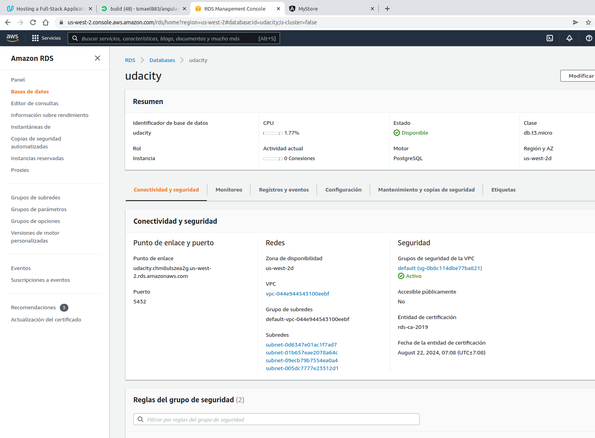
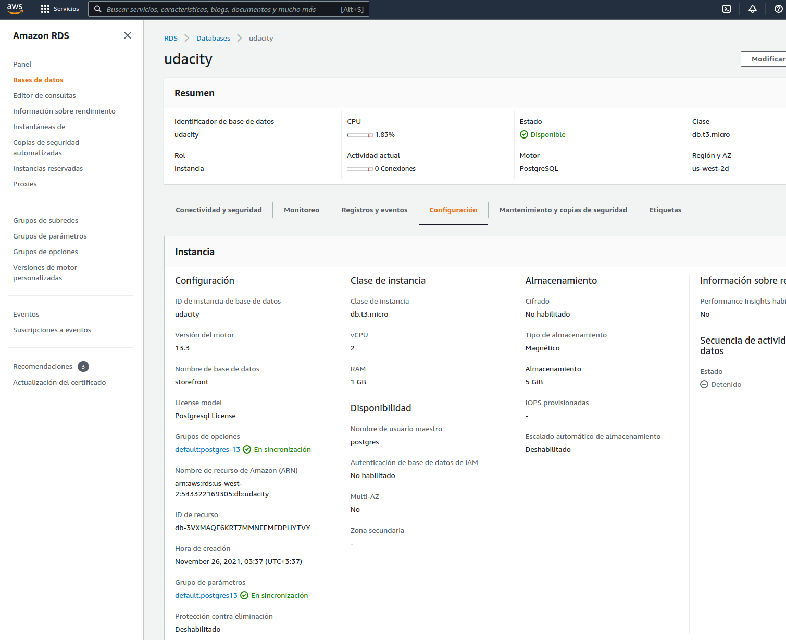

# ARCHITECTURE

This application uses the following AWS Services:
1) Database is deployed in an RDS Postgres DB
2) Backend API is deployed using a Beanstalk for Node applications
3) Frontend is server trough an S3 Bucket

The architecture diagram is as follows:

## RDS

The database is a RDS service type postgres. Note that it is not required to make it publicly accessible due to the API that will interact with the RDS is within the same VPC (see previous architecture diagram)

## BEANSTALK

The express API is deployed in a Beanstalk service. This service needs to be published trough port 443 due to S3 bucket is also HTTPS. And therefore if API is not in HTTPS there is a security error 

Another important thing here is to configure in the beanstalk environment all the ENV variables required for the application to run (important to start express in 8081, which is the default port NGINX will redirect traffic):

## S3

Finally the angular application, due to it's a "static" can be easily published trough a S3 bucket. For that the only consideration is to flag the parameter "serve static website" in it's configuration

