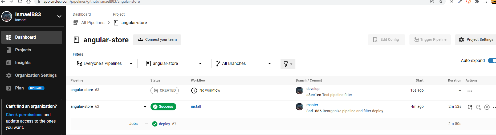

# ANGULAR-STORE

This document contains the information related to the pipeline define in CIRCLECI to have CI/CD integration

Within folder .circleci you can find config.yml with all the steps preconfigured to achieve the CI/CD integration. This file works in conjunction with each bin/deploy.sh files in storefront-backend-api and storefront-frontend. As well as general package.json file (that you can find in this same path):

The config.yml file forces CircleCI to use node version 14.18.1. This is due to the existing problem in version 17.1 (which is the default stable version used by CircleCI at the moment) with crypto SSL (more info searching "node 17 digital envelope routines"). 

# LAST BUILD




# PIPELINE DOCUMENTATION

* Step to install node@14.18.1
```
  - run: 
      name: install node@14.18.1
      command: |
          set +e         
          touch $BASH_ENV    
          curl -o- https://raw.githubusercontent.com/creationix/nvm/v0.33.5/install.sh | bash
          echo 'export NVM_DIR="$HOME/.nvm"' >> $BASH_ENV
          echo '[ -s "$NVM_DIR/nvm.sh" ] && \. "$NVM_DIR/nvm.sh"' >> $BASH_ENV
          echo nvm install 14.18.1 >> $BASH_ENV
          echo nvm alias default 14.18.1 >> $BASH_ENV
```

* Install EB Cli
```
  - run:
      name: Install EB Cli
      working_directory: /
      command: |
        sudo apt-get -y -qq update
        sudo apt-get install python3-pip python3-dev build-essential
        sudo pip3 install awsebcli
```

* Install dependencies and build frontend application
```
  - run:
      name: Front-End Install
      command: |
        npm run frontend:install
  - run:
      name: Front-End Build
      command: |
        npm run frontend:build
```

* Install dependencies and build backend application
```
  - run:
      name: Back-End Install
      command: |
        npm run backend:install
  - run:
      name: Back-End Build
      command: |
        npm run backend:build
```

* Deploy frontend (to S3 bucket) and backend (to Beanstalk)
```
  - run:
      name: Front-End Deploy
      command: |
        npm run frontend:deploy
  - run:
      name: Back-End Deploy
      command: |
        npm run backend:deploy
```

* Deploy frontend script

Within storefront-frontend/bin/deploy.sh there is the instruction to deploy the angular app into the S3 bucket
```
aws s3 cp --recursive --acl public-read dist/myStore s3://udacity-nanodegree-js-iba
```

* Deploy backend script

Within storefront-backend-api/bin/deploy.sh there is the instruction to deploy the express API into the beanstalk
```
eb init --region us-west-2 --platform node.js-14 storefront-backend-api
eb deploy storefront-backend-api-dev
```
